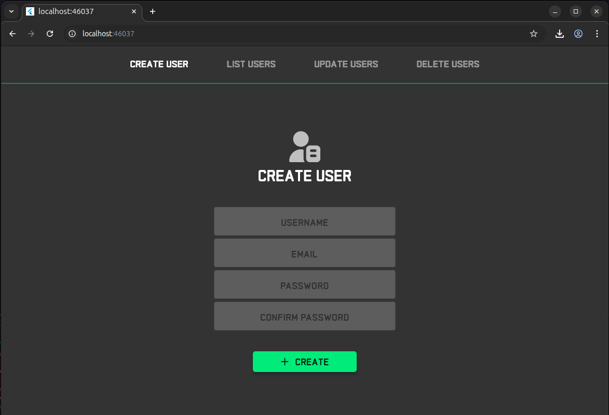

# Simple CRUD Project with Python Backend, Dart interface, MySQL, Nginx and Docker.
### 📒**About:**

This project was conceived as a personal challenge to practically apply and test all the best practices I have been studying in Full-Stack development. My main motivation was to build a complete CRUD application using the technologies that have interested me the most lately, always focusing on following strong code conventions and architecture.

For this, I envisioned an architecture that would unite a robust backend in Python (FastAPI) with a modern, cross-platform interface developed in Dart and Flutter. I planned that, to ensure the application would be scalable and have consistent deployment, the entire environment would be fully containerized with Docker. Nginx was intended to act strategically as the entry point that manages and load balances between multiple backend containers, in addition to serving the static frontend files.

The result is a distributed and efficient system, which demonstrates how these different technologies integrate to form a cohesive and production-ready solution. Feel free to explore the architecture and the code!

___

### 🧪**Versions of the main technologies used:**
- **Fast API** >= 0.119.0
- **Uvicorn** >= 0.37.0
- **SQLAlchemy** >= 2.0.44
- **Pytest** >= 8.4.2
- **python-decouple** >= 3.8
- **argon2-cffi** >= 25.1.0
- **Flutter** >= 3.35.1

Obs: all dependencies used can be found in the dependency control files (pyproject.toml and pubspec.yaml).
___

### 🎨**Preview of the interface created with Flutter:**
[Design da applicação no Figma](https://www.figma.com/design/bN49sVb90XYx9s1Hpumjqu/Sem-t%C3%ADtulo?m=auto&t=vzVUMUTawlX4mAXg-1)

___