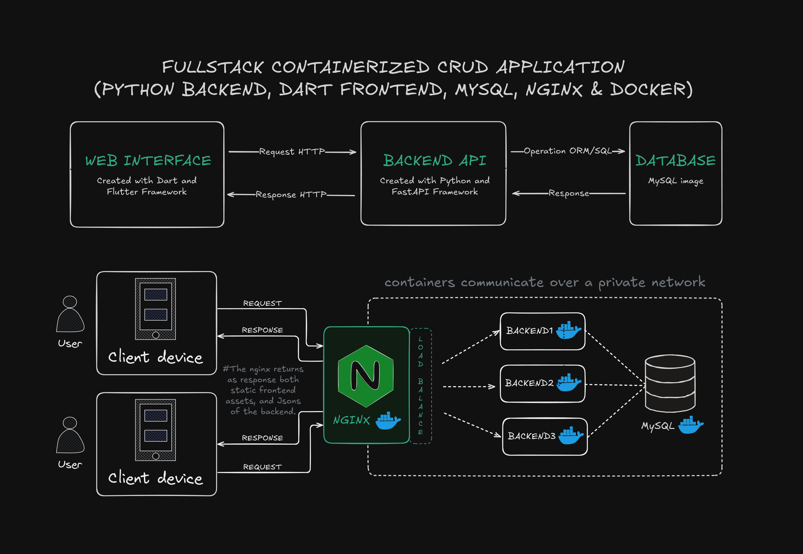
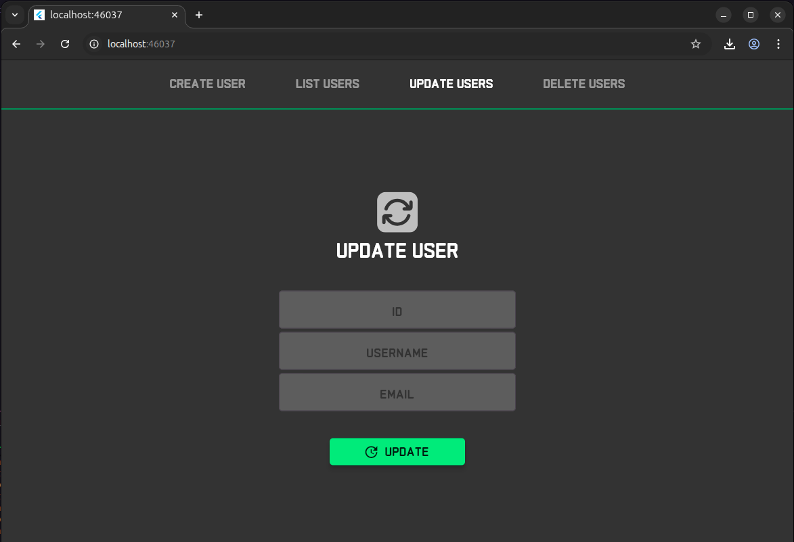
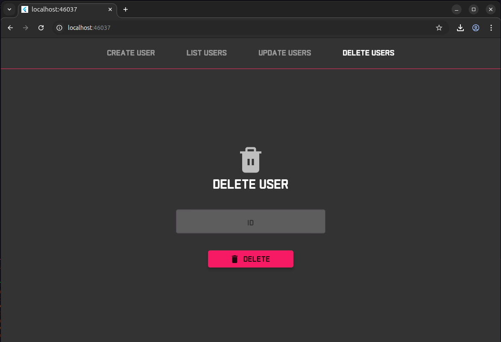

# Simple CRUD Project with Python Backend, Dart Interface and MySQL database with Docker.
### **About:**

In this project, i intend to test all the best pactices i learned during my backend studies with Python and add some of my more recent studies on creating cross-platform interfaces with Dart and Flutter.

___

### Main technologies used:
- **Fast API** >= 0.119.0
- **Uvicorn** >= 0.37.0
- **SQLAlchemy** >= 2.0.44
- **Pytest** >= 8.4.2
- **python-decouple** >= 3.8
- **argon2-cffi** >= 25.1.0
- **Flutter** >= 3.35.1

Obs: all dependencies used can be found in the dependency control files (pyproject.toml and pubspec.yaml).
___

### Design Interface created with Figma:

___